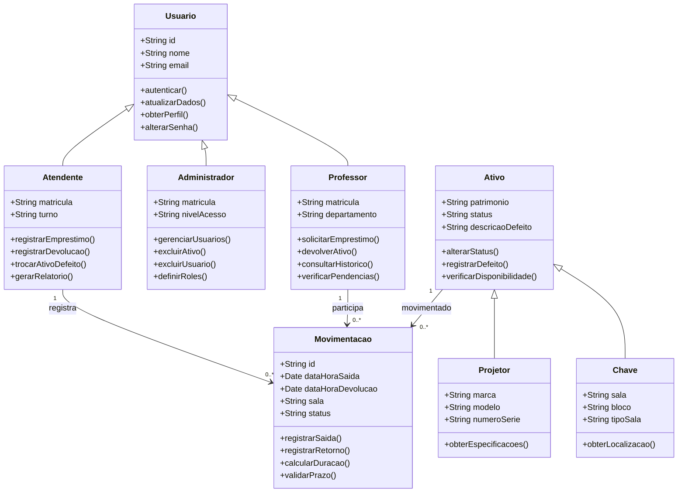
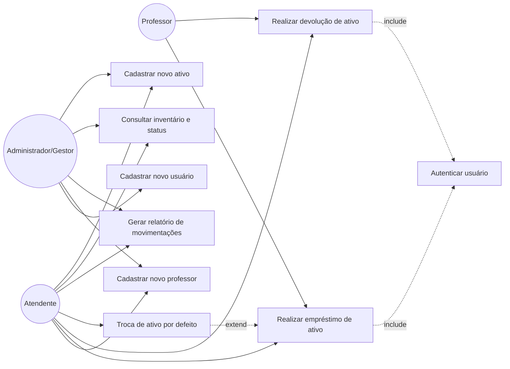

# DOCUMENTO DE REQUISITOS - Aplicativo GAC

---

## 1. VISÃO GERAL

### 1.1. Introdução

A coordenação do Centro de Tecnologia (CT) gerencia diariamente a movimentação intensa de projetores multimídia e chaves de laboratórios e salas de aula. Atualmente, o fluxo envolve professores, estagiários e funcionários da secretaria, exigindo um registro preciso de quem retirou o item, o horário e a finalidade acadêmica.

### 1.2. Objetivo Geral

Criar uma aplicação de gestão patrimonial para o controle de empréstimos e devoluções de ativos do CT.

### 1.3. Objetivos Específicos

- Desenvolver um banco de dados de inventário, contemplando projetores com número de série e chaves por bloco/sala.
- Implementar um sistema de autenticação para professores e funcionários.
- Desenvolver uma aplicação web para o gerenciamento de ativos e usuários.

---

## 2. ATORES

### 2.1. Atendente

- **Descrição:** Funcionários da secretaria do Centro de Ciências Tecnológicas (CCT) da UNIFOR que lidam com o controle patrimonial.
- **Ações Principais:** Emprestar itens, receber devoluções, gerenciar estoque e gerar relatórios.

### 2.2. Administrador/Gestor

- **Descrição:** Diretor do Centro de Ciências Tecnológicas.
- **Ações Principais:** Gerenciar os usuários do sistema.

### 2.3. Professor

- **Descrição:** Usuário dos ativos do Centro de Ciências Tecnológicas.
- **Ações Principais:** Solicitar empréstimo e realizar a devolução de projetores.

---

## 3. REQUISITOS FUNCIONAIS

| ID | Requisito | Descrição | Prioridade |
| :--- | :--- | :--- | :--- |
| **RF01** | Autenticação | Página de login com matrícula e senha. | Alta |
| **RF01.1** | Validação | Validar credenciais e exibir mensagens de erro. | Alta |
| **RF01.2** | Provedor Auth | Utilizar Firebase Authentication. | Alta |
| **RF02** | Cadastro | Cadastro de novos usuários com nome, matrícula, e-mail e senha. | Alta |
| **RF02.1** | Persistência | Armazenar dados no Firebase Realtime Database. | Alta |
| **RF02.2** | Unicidade | Validar se e-mail ou matrícula já estão cadastrados. | Alta |
| **RF03** | Navegação | Implementar rotas via React Router. | Alta |
| **RF03.1** | Proteção | Redirecionar usuários não autenticados para o login. | Alta |
| **RF04** | Listagem | Exibir itens recuperados do banco de dados. | Alta |
| **RF04.1** | Detalhes | Permitir navegação para detalhamento do item. | Alta |
| **RF05** | CRUD Projetor | Cadastro com marca, modelo, patrimônio e status. | Alta |
| **RF06** | CRUD Chave | Cadastro com sala, bloco e status. | Alta |
| **RF07** | CRUD Usuário | Cadastro com nome, e-mail, matrícula e role. | Alta |
| **RF08** | Movimentação | Registro de empréstimo/devolução com data, hora, professor e sala. | Alta |

---

## 4. REQUISITOS NÃO FUNCIONAIS

| ID | Categoria | Descrição | Prioridade |
| :--- | :--- | :--- | :--- |
| **RNF01** | Tecnologia | Front-end em React.js e Back-end em Java/Spring Boot. | Alta |
| **RNF02** | Compatibilidade | Compatível com Chrome, Firefox e Edge. | Alta |
| **RNF02.1** | Responsividade | Interface adaptável para desktop, tablet e mobile. | Média |
| **RNF03** | Desempenho | Carregamento de páginas inferior a 3 segundos. | Média |
| **RNF03.2** | Desempenho | Operações de CRUD concluídas em menos de 2 segundos. | Média |
| **RNF04** | Segurança | Conformidade com a LGPD e uso de Firebase Auth. | Alta |
| **RNF05** | Usabilidade | Interface intuitiva e design consistente. | Alta |

---

## 5. CASOS DE USO

### UC01 - Cadastrar Novo Usuário

- **Ator:** Administrador ou Gestor.
- **Descrição:** Permite a criação de novos perfis para operar o sistema, incluindo atendentes e gestores.
- **Fluxo Principal:**
  1. O administrador acessa a área de gestão de usuários.
  2. O administrador insere nome, e-mail, matrícula e nível de acesso.
  3. O sistema valida os dados.
  4. O sistema persiste os dados no Firebase.

### UC02 - Cadastrar Novo Professor

- **Ator:** Atendente ou Administrador.
- **Descrição:** Permite registrar professores habilitados a solicitar empréstimos.
- **Fluxo Principal:**
  1. O atendente solicita a matrícula e o nome completo do professor.
  2. O sistema verifica se a matrícula já existe.
  3. O sistema salva o registro como perfil de professor.

### UC03 - Realizar Empréstimo de Ativo

- **Ator:** Atendente.
- **Descrição:** Permite registrar a saída de um projetor ou chave para uso acadêmico.
- **Fluxo Principal:**
  1. O atendente identifica o professor pela matrícula.
  2. O sistema lista os ativos disponíveis.
  3. O atendente seleciona o ativo, podendo ser projetor ou chave.
  4. O atendente confirma a data e a hora.
  5. O sistema altera o status do ativo para **Emprestado**.

### UC04 - Realizar Devolução de Ativo

- **Ator:** Atendente.
- **Descrição:** Permite registrar o retorno do item à secretaria.
- **Fluxo Principal:**
  1. O atendente localiza o empréstimo ativo pelo item ou pela matrícula do professor.
  2. O atendente confirma o recebimento e verifica o estado do item.
  3. O sistema registra o horário de devolução.
  4. O sistema altera o status do ativo para **Disponível**.

### UC05 - Troca de Ativo por Defeito

- **Ator:** Atendente.
- **Descrição:** Permite substituir rapidamente um item durante um empréstimo em caso de falha técnica.
- **Fluxo Principal:**
  1. O atendente acessa o empréstimo em curso.
  2. O atendente seleciona a opção **Trocar por defeito**.
  3. O sistema altera o status do item defeituoso para **Em Manutenção**.
  4. O atendente seleciona um novo item disponível para substituição.
  5. O sistema gera um novo vínculo de movimentação para o item substituto.

### UC06 - Gerar Relatório de Movimentações

- **Ator:** Atendente ou Administrador.
- **Descrição:** Permite gerar logs de todas as saídas e entradas em um período.
- **Fluxo Principal:**
  1. O usuário seleciona o período desejado.
  2. O sistema filtra todas as movimentações, incluindo empréstimos, devoluções e trocas.
  3. O sistema exibe a lista formatada ou permite exportação dos dados.

### UC07 - Consultar Inventário e Status de Ativos

- **Ator:** Atendente ou Gestor.
- **Descrição:** Permite visualizar rapidamente o estado de todos os itens do patrimônio.
- **Fluxo Principal:**
  1. O usuário acessa a dashboard de ativos.
  2. O sistema exibe a lista filtrável por status.
  3. O usuário consulta a situação dos ativos.

- **Status possíveis:**
  - **Disponível:** Item pronto para uso.
  - **Emprestado:** Item em uso, com identificação do professor responsável.
  - **Em Manutenção:** Item com defeito aguardando reparo.

### UC08 - Cadastrar Novo Ativo

- **Ator:** Atendente ou Administrador.
- **Descrição:** Permite incluir novos itens físicos no inventário do CT.
- **Fluxo Principal:**
  1. O usuário escolhe o tipo de ativo, podendo ser chave ou projetor.
  2. O usuário preenche os dados obrigatórios.
  3. Para projetores, informa marca, modelo e número de patrimônio.
  4. Para chaves, informa sala e bloco.
  5. O sistema define o status inicial como **Disponível**.

---

## 6. REGRAS DE NEGÓCIO (RN)

| ID | Regra | Descrição |
| :--- | :--- | :--- |
| **RN01** | **Disponibilidade de Ativo** | Um ativo, projetor ou chave, só pode ser emprestado se o seu status atual for **Disponível**. |
| **RN02** | **Limite de Empréstimos** | Cada professor pode ter, no máximo, um projetor e uma chave de sala simultaneamente. |
| **RN03** | **Identificação Obrigatória** | Nenhum empréstimo pode ser realizado sem o registro da matrícula válida do professor e a assinatura digital/confirmação do atendente. |
| **RN04** | **Tempo de Permanência** | O empréstimo deve ser encerrado obrigatoriamente até o final do turno em que foi realizado, seja manhã, tarde ou noite. |
| **RN05** | **Bloqueio de Pendência** | Professores com itens em atraso ficam impedidos de realizar novos empréstimos até a regularização. |
| **RN06** | **Registro de Defeito** | Ao trocar um ativo por defeito, o sistema deve obrigatoriamente exigir uma breve descrição da falha para fins de manutenção. |
| **RN07** | **Hierarquia de Cadastro** | Apenas usuários com perfil **Administrador/Gestor** podem excluir ativos ou usuários do sistema. Atendentes podem apenas cadastrar ou editar. |
| **RN08** | **Integridade de Histórico** | Movimentações finalizadas não podem ser excluídas, apenas consultadas para fins de auditoria e relatórios. |

---

## 7. DIAGRAMA DE CLASSES

O diagrama de classes a seguir representa a estrutura estática do Aplicativo GAC, descrevendo as principais entidades do sistema, seus atributos, métodos e relacionamentos. O modelo foi projetado para atender aos requisitos funcionais relacionados ao controle patrimonial de projetores e chaves, à autenticação de usuários e ao registro das movimentações de empréstimo e devolução.

### 7.1. Estrutura Geral do Modelo

O modelo é organizado em torno de três abstrações principais:

- **Usuário:** representa os perfis humanos autenticados no sistema.
- **Ativo:** representa os bens patrimoniais controlados pelo CT.
- **Movimentação:** representa as operações de empréstimo, devolução ou troca.

A classe abstrata **Usuario** centraliza atributos e comportamentos comuns aos três perfis humanos do sistema: Atendente, Administrador e Professor. A classe abstrata **Ativo** generaliza os bens patrimoniais controlados pelo CT, sendo especializada em Projetor e Chave. A classe **Movimentacao** funciona como entidade associativa entre usuário e ativo, registrando cada operação realizada no sistema.

### 7.2. Descrição das Classes

#### 7.2.1. Classe Usuario

Representa qualquer pessoa autenticada no sistema. Concentra os atributos **id**, **nome** e **email**, além dos métodos comuns **autenticar()**, **atualizarDados()**, **obterPerfil()** e **alterarSenha()**. É herdada pelas classes **Atendente**, **Administrador** e **Professor**.

#### 7.2.2. Classe Atendente

Representa o funcionário da secretaria do CCT responsável pela operação do sistema. Possui matrícula e turno de trabalho. É responsável por registrar empréstimos, devoluções, trocas por defeito e gerar relatórios.

#### 7.2.3. Classe Administrador

Representa o diretor do CCT ou usuário com permissões elevadas. Pode gerenciar usuários, excluir ativos e usuários do sistema e definir papéis de acesso, conforme a regra **RN07**.

#### 7.2.4. Classe Professor

Representa o usuário final dos ativos. Pode solicitar empréstimos, registrar devoluções, consultar seu histórico de movimentações e verificar pendências relacionadas à regra **RN05**.

#### 7.2.5. Classe Ativo

Generaliza os bens patrimoniais controlados. Possui número de patrimônio, status e descrição de defeito. Seus métodos incluem **alterarStatus()**, **registrarDefeito()** e **verificarDisponibilidade()**, este último associado diretamente à regra **RN01**.

#### 7.2.6. Classe Projetor

Especialização de **Ativo**. Adiciona os atributos **marca**, **modelo** e **numeroSerie**, conforme exigido pelo requisito **RF05**.

#### 7.2.7. Classe Chave

Especialização de **Ativo**. Adiciona os atributos **sala**, **bloco** e **tipoSala**, conforme exigido pelo requisito **RF06**.

#### 7.2.8. Classe Movimentacao

Registra cada operação de empréstimo ou devolução. Contém data e hora de saída, data e hora de devolução, sala destino e status corrente. Implementa métodos para registrar saída, registrar retorno, calcular duração e validar o prazo do turno, dando suporte direto às regras **RN04** e **RN08**.

### 7.3. Resumo de Atributos e Métodos

| Classe | Atributos | Métodos principais |
| :--- | :--- | :--- |
| **Usuario** | id, nome, email | autenticar(), atualizarDados(), obterPerfil(), alterarSenha() |
| **Atendente** | matricula, turno | registrarEmprestimo(), registrarDevolucao(), trocarAtivoDefeito(), gerarRelatorio() |
| **Administrador** | matricula, nivelAcesso | gerenciarUsuarios(), excluirAtivo(), excluirUsuario(), definirRoles() |
| **Professor** | matricula, departamento | solicitarEmprestimo(), devolverAtivo(), consultarHistorico(), verificarPendencias() |
| **Ativo** | patrimonio, status, descricaoDefeito | alterarStatus(), registrarDefeito(), verificarDisponibilidade() |
| **Projetor** | marca, modelo, numeroSerie | obterEspecificacoes() |
| **Chave** | sala, bloco, tipoSala | obterLocalizacao() |
| **Movimentacao** | id, dataHoraSaida, dataHoraDevolucao, sala, status | registrarSaida(), registrarRetorno(), calcularDuracao(), validarPrazo() |

### 7.4. Relacionamentos do Modelo

| Relacionamento | Tipo | Descrição |
| :--- | :--- | :--- |
| **Atendente → Usuario** | Herança | Atendente é um tipo especializado de Usuario. |
| **Administrador → Usuario** | Herança | Administrador é um tipo especializado de Usuario. |
| **Professor → Usuario** | Herança | Professor é um tipo especializado de Usuario. |
| **Projetor → Ativo** | Herança | Projetor é um tipo especializado de Ativo. |
| **Chave → Ativo** | Herança | Chave é um tipo especializado de Ativo. |
| **Atendente ↔ Movimentacao** | Associação 1..* | Um atendente registra zero ou várias movimentações; cada movimentação é registrada por um atendente. |
| **Professor ↔ Movimentacao** | Associação 1..* | Um professor pode ter zero ou várias movimentações ao longo do tempo; cada movimentação envolve um professor. |
| **Movimentacao ↔ Ativo** | Associação 1..* | Cada movimentação refere-se a exatamente um ativo; um ativo participa de várias movimentações ao longo do tempo. |

### 7.5. Diagrama em Mermaid

### 7.6. Observações sobre as Regras de Negócio

Algumas regras de negócio impactam diretamente o comportamento das classes do modelo:

- **RN01** e **RN02** são validadas no método **verificarDisponibilidade()** de **Ativo** e em **registrarEmprestimo()** de **Atendente**.
- **RN04** é tratada por **validarPrazo()** em **Movimentacao**.
- **RN05** é verificada pelo método **verificarPendencias()** de **Professor**.
- **RN06** é tratada por **registrarDefeito()** de **Ativo** e **trocarAtivoDefeito()** de **Atendente**.
- **RN07** é garantida pelos métodos exclusivos da classe **Administrador**.
- **RN08** é implementada pela ausência de método de exclusão em **Movimentacao**.

---

## 8. DIAGRAMA DE CASOS DE USO

O diagrama de casos de uso modela as interações entre os atores do sistema e as funcionalidades oferecidas pelo Aplicativo GAC. Foram identificados oito casos de uso principais, além de um caso de uso transversal de autenticação que apoia as operações sensíveis do sistema.

### 8.1. Atores do Sistema

#### 8.1.1. Atendente

Funcionário da secretaria do CCT, ator principal das operações cotidianas. Interage com a maior parte dos casos de uso, exceto pelo cadastro de novos usuários administrativos, que é exclusivo do Administrador.

#### 8.1.2. Administrador/Gestor

Diretor do CCT ou usuário com permissões superiores. Pode cadastrar usuários do sistema, gerar relatórios, consultar o inventário e cadastrar novos ativos.

#### 8.1.3. Professor

Usuário final dos ativos. Participa indiretamente do empréstimo e da devolução, sendo identificado pela matrícula no momento da operação realizada pelo atendente.

### 8.2. Casos de Uso e Relacionamentos

| ID | Caso de Uso | Atores | Relação |
| :--- | :--- | :--- | :--- |
| **UC01** | Cadastrar novo usuário | Administrador | Associação direta |
| **UC02** | Cadastrar novo professor | Atendente, Administrador | Associação direta |
| **UC03** | Realizar empréstimo de ativo | Atendente, Professor | Include: Autenticar usuário |
| **UC04** | Realizar devolução de ativo | Atendente, Professor | Include: Autenticar usuário |
| **UC05** | Troca de ativo por defeito | Atendente | Extend: UC03 - Realizar empréstimo |
| **UC06** | Gerar relatório de movimentações | Atendente, Administrador | Associação direta |
| **UC07** | Consultar inventário e status | Atendente, Administrador | Associação direta |
| **UC08** | Cadastrar novo ativo | Atendente, Administrador | Associação direta |

### 8.3. Diagrama em Mermaid

### 8.4. Relações entre Casos de Uso

#### 8.4.1. Relação Include

Os casos de uso **UC03 - Realizar empréstimo de ativo** e **UC04 - Realizar devolução de ativo** incluem obrigatoriamente o caso de uso **Autenticar usuário**, uma vez que toda movimentação patrimonial exige a identificação do atendente responsável e a validação da matrícula do professor, conforme a regra **RN03 - Identificação Obrigatória**.

#### 8.4.2. Relação Extend

O caso de uso **UC05 - Troca de ativo por defeito** estende o caso de uso **UC03 - Realizar empréstimo de ativo**. A extensão ocorre quando, durante um empréstimo em curso, o atendente identifica falha técnica no item e dispara o fluxo alternativo de substituição, conforme a regra **RN06 - Registro de Defeito**.

### 8.5. Descrição Resumida dos Casos de Uso

| ID | Caso de Uso | Descrição Resumida |
| :--- | :--- | :--- |
| **UC01** | Cadastrar novo usuário | Permite criar perfis de atendente ou gestor com nome, e-mail, matrícula e nível de acesso. |
| **UC02** | Cadastrar novo professor | Permite registrar professores habilitados a solicitar empréstimos, validando unicidade da matrícula. |
| **UC03** | Realizar empréstimo de ativo | Permite selecionar um ativo disponível e registrar o empréstimo para um professor. |
| **UC04** | Realizar devolução de ativo | Permite localizar empréstimo ativo, registrar a devolução e liberar o ativo. |
| **UC05** | Troca de ativo por defeito | Permite substituir item com falha técnica e registrar descrição do defeito. |
| **UC06** | Gerar relatório de movimentações | Permite filtrar movimentações por período e exportar dados para auditoria. |
| **UC07** | Consultar inventário e status de ativos | Permite visualizar ativos disponíveis, emprestados e em manutenção. |
| **UC08** | Cadastrar novo ativo | Permite incluir projetores ou chaves no inventário com seus dados obrigatórios. |

## 9. DIAGRAMA DE SEQUÊNCIA

## 10. PROTÓTIPO DE BAIXA FIDELIDADE

