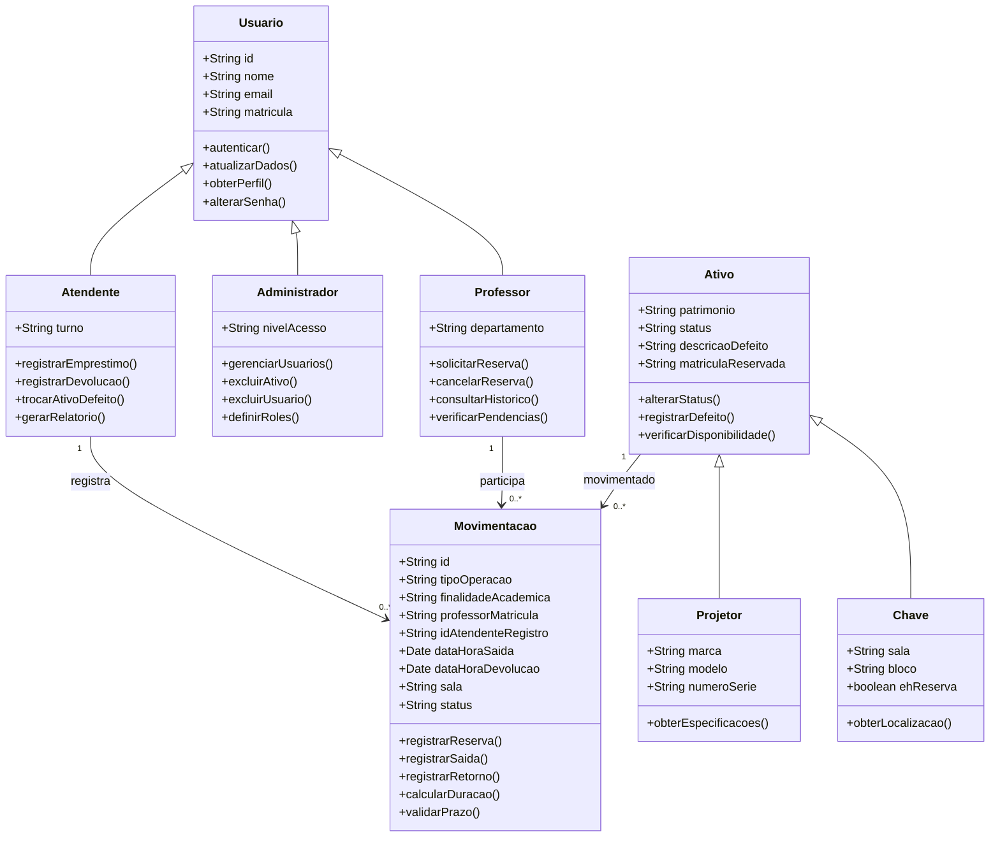
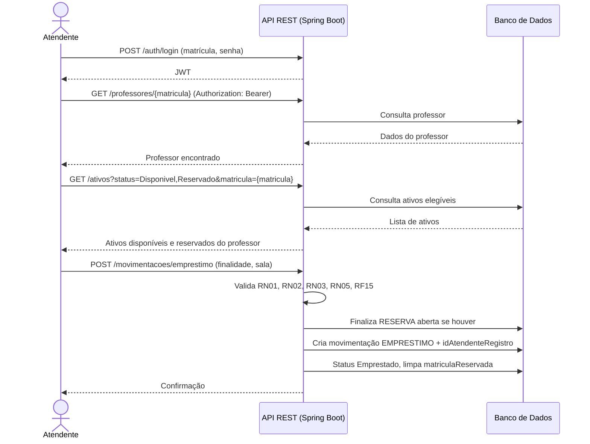
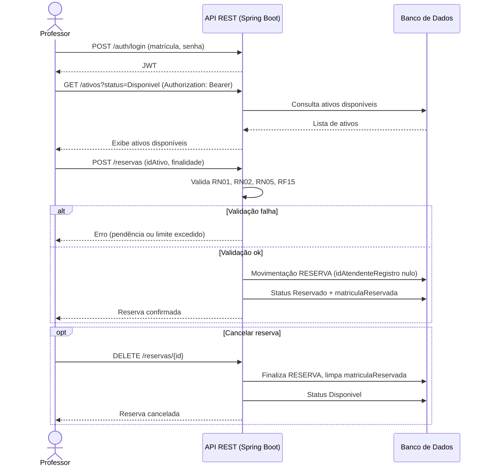
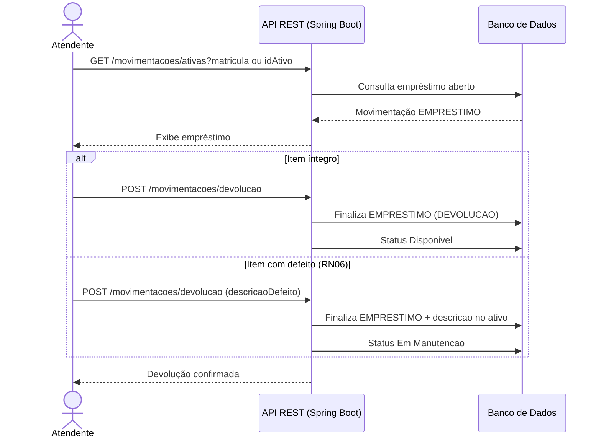
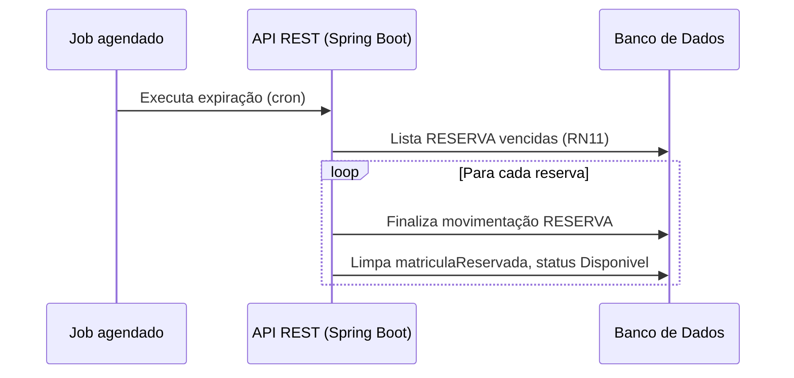

# DOCUMENTO DE REQUISITOS - Aplicativo GAC

**Versão:** 1.2  
**Data:** 2026-05-25  
**Escopo:** Gestão patrimonial de projetores e chaves do CCT/UNIFOR

---

## ÍNDICE

1. [Visão geral](#1-visão-geral)
2. [Atores](#2-atores)
3. [Requisitos funcionais](#3-requisitos-funcionais)
4. [Requisitos não funcionais](#4-requisitos-não-funcionais)
5. [Casos de uso](#5-casos-de-uso) (UC01–UC18, sem UC16)
6. [Regras de negócio](#6-regras-de-negócio-rn)
7. [Diagrama de classes](#7-diagrama-de-classes)
8. [Diagrama de casos de uso](#8-diagrama-de-casos-de-uso)
9. [Diagramas de sequência](#9-diagramas-de-sequência)
10. [Protótipo de baixa fidelidade](#10-protótipo-de-baixa-fidelidade)

- [Glossário](#glossário)
- [Matriz de rastreabilidade](#matriz-de-rastreabilidade)

---

## GLOSSÁRIO

| Termo | Definição |
| :--- | :--- |
| **CCT** | Centro de Ciências Tecnológicas da UNIFOR — unidade gestora do patrimônio descrito neste documento. |
| **Atendente** | Funcionário da secretaria (ou estagiário com o mesmo perfil no sistema) que registra empréstimos, devoluções, trocas e relatórios. |
| **Estagiário** | Atua no balcão com o perfil **Atendente** no sistema; não é um perfil separado. |
| **Administrador/Gestor** | Perfil com permissões elevadas (gestão de usuários, exclusão de registros, conforme RN07). |
| **Professor** | Usuário que pode **reservar** ativos; a **devolução** é sempre registrada pelo atendente. |
| **Reserva** | Solicitação antecipada do professor; o ativo passa ao status **Reservado** até o atendente confirmar o empréstimo (UC03). |
| **Status do ativo** | `Disponível`, `Reservado`, `Emprestado`, `Em Manutenção` — vocabulário único para projetores e chaves. |
| **Chave reserva** | Chave com `ehReserva = true` (cópia de segurança), não entidade separada. |
| **Turno** | Manhã (07h–12h), tarde (12h–18h), noite (18h–23h) — referência para RN04, RN05 e RN11. |
| **Pendência** | Empréstimo não devolvido até o fim do turno de saída (RN04) ou reserva não retirada após RN11. |
| **role** | `ADMIN`, `ATENDENTE`, `PROFESSOR` — controle de acesso (RF07). |
| **tipoOperacao** | `RESERVA`, `EMPRESTIMO`, `DEVOLUCAO`, `TROCA` — classificação em **Movimentacao**. |

---

## MATRIZ DE RASTREABILIDADE

| RF | UC principal | RN |
| :--- | :--- | :--- |
| RF01–RF01.4 | Autenticação (transversal), UC18 | RNF04 |
| RF02, RF07 | UC01, UC02 | RN07 |
| RF04, RF04.1 | UC07, UC09, UC12 | — |
| RF05, RF06 | UC08, UC10, UC13, UC14 | RN07, RN09 |
| RF08, RF13, RF15 | UC03, UC04, UC11, UC05 | RN01–RN06, RN11 |
| RF09 | UC09 | RN10 |
| RF10 | UC10 | RN09 |
| RF11 | UC06 | RN08 |
| RF12 | UC05 | RN06 |
| RF14 | UC12 | RN05 |
| RF16 | UC15 | — |
| RF17 | UC17 | RN11 |

---

## 1. VISÃO GERAL

### 1.1. Introdução

A coordenação do Centro de Ciências Tecnológicas (CCT) gerencia diariamente a movimentação intensa de projetores multimídia e chaves de laboratórios e salas de aula. O fluxo envolve professores e equipe da secretaria (funcionários e estagiários, este último com perfil **Atendente** no sistema), exigindo registro de quem retirou o item e horário.

### 1.2. Objetivo Geral

Criar uma aplicação de gestão patrimonial para o controle de empréstimos e devoluções de ativos do CCT.

### 1.3. Objetivos Específicos

- Desenvolver um banco de dados de inventário, contemplando projetores com número de patrimônio, número de série, marca e modelo, e chaves por bloco/sala.
- Implementar um sistema de autenticação para professores e funcionários.
- Desenvolver uma aplicação web para o gerenciamento de ativos e usuários.

---

## 2. ATORES

### 2.1. Atendente

- **Descrição:** Funcionários e estagiários da secretaria do CCT/UNIFOR no controle patrimonial (mesmo perfil `ATENDENTE` no sistema).
- **Ações Principais:** Emprestar itens (UC03), receber devoluções (UC04), cadastrar e editar ativos (UC08, UC13), consultar inventário (UC07), cadastrar professor (UC02), gerar relatórios (UC06), liberar itens da manutenção (UC15).

### 2.2. Administrador/Gestor

- **Descrição:** Diretor do Centro de Ciências Tecnológicas (CCT) da UNIFOR.
- **Ações Principais:** Gerenciar usuários (UC01); cadastrar professores e ativos; consultar inventário (UC07); gerar relatórios (UC06); excluir ativos (UC14); gerenciar chaves reserva (UC10).

### 2.3. Professor

- **Descrição:** Docente do CCT habilitado no sistema.
- **Ações Principais:** Solicitar reserva (UC11); consultar histórico e pendências (UC12); pesquisar itens (UC09); alterar senha (UC18). Devolução registrada apenas pelo atendente (UC04).

---

## 3. REQUISITOS FUNCIONAIS

| ID | Requisito | Descrição | Prioridade |
| :--- | :--- | :--- | :--- |
| **RF01** | Autenticação | Página de login com matrícula e senha. | Alta |
| **RF01.1** | Validação | Validar credenciais e exibir mensagens de erro. | Alta |
| **RF01.2** | Autenticação JWT | Emitir e validar tokens JWT; proteger rotas da API. | Alta |
| **RF01.3** | Logout | Encerrar sessão e invalidar token no cliente. | Média |
| **RF01.4** | Alterar senha | Usuário autenticado altera a própria senha (UC18). | Média |
| **RF02** | Cadastro de usuário interno | Administrador cadastra atendentes/gestores (UC01), com senha inicial. | Alta |
| **RF02.1** | Persistência | Persistir dados via API REST (Spring Boot) em banco relacional. | Alta |
| **RF02.2** | Unicidade | Validar se e-mail ou matrícula já estão cadastrados. | Alta |
| **RF03** | Navegação | Implementar rotas via React Router. | Alta |
| **RF03.1** | Proteção de rotas | Redirecionar usuários não autenticados para o login. | Alta |
| **RF04** | Listagem | Exibir itens recuperados do banco de dados. | Alta |
| **RF04.1** | Detalhes | Permitir navegação para detalhamento do item. | Alta |
| **RF05** | CRUD Projetor | Criar, listar, editar (UC13); excluir só administrador (UC14). Patrimônio, série, marca, modelo, status. | Alta |
| **RF06** | CRUD Chave | Criar, listar, editar (UC13); excluir só administrador (UC14). Sala, bloco, `ehReserva`, patrimônio opcional. | Alta |
| **RF07** | CRUD Usuário | Criar/editar usuários e professores; roles `ADMIN`, `ATENDENTE`, `PROFESSOR`. | Alta |
| **RF08** | Movimentação | Registrar reserva, empréstimo, devolução e troca com data, hora, professor, sala, finalidade e tipo. | Alta |
| **RF09** | Pesquisa de Itens | Pesquisar por patrimônio, série, marca, modelo, tipo, sala, bloco, status ou chave reserva. | Alta |
| **RF10** | Chave Reserva | Marcar/desmarcar chaves como reserva (`ehReserva`), vinculadas a sala e bloco. | Alta |
| **RF11** | Relatório | Gerar relatório de movimentações por período, com exportação. | Alta |
| **RF12** | Troca por Defeito | Registrar troca durante empréstimo ativo, com descrição obrigatória do defeito. | Alta |
| **RF13** | Reserva de Ativo | Professor solicita reserva; status **Reservado** vinculado à matrícula. | Alta |
| **RF14** | Histórico e pendências | Professor consulta movimentações e bloqueios (UC12). | Alta |
| **RF15** | Liberar manutenção | Atendente/admin altera ativo de **Em Manutenção** para **Disponível** (UC15). | Alta |
| **RF16** | Expiração de reservas | Job automático aplica RN11 (UC17). | Média |

---

## 4. REQUISITOS NÃO FUNCIONAIS

| ID | Categoria | Descrição | Prioridade |
| :--- | :--- | :--- | :--- |
| **RNF01** | Tecnologia | Front-end em React.js; back-end em Java/Spring Boot com banco relacional; autenticação JWT. | Alta |
| **RNF02** | Compatibilidade | Compatível com Chrome, Firefox e Edge. | Alta |
| **RNF02.1** | Responsividade | Interface adaptável para desktop, tablet e mobile. | Média |
| **RNF03** | Desempenho | Carregamento de páginas inferior a 3 segundos. | Média |
| **RNF03.1** | Desempenho | Operações de CRUD concluídas em menos de 2 segundos. | Média |
| **RNF04** | Segurança | Conformidade com a LGPD; senhas com hash; HTTPS; tokens JWT com expiração. | Alta |
| **RNF05** | Usabilidade | Interface intuitiva e design consistente. | Alta |
| **RNF06** | Confiabilidade | Back-up do banco; logs de auditoria para movimentações; alta disponibilidade da API. | Média |

---

## 5. CASOS DE USO

> Caso transversal: **Autenticar usuário** (login JWT) — incluído nos fluxos que exigem autenticação.

### UC01 - Cadastrar Novo Usuário

- **Ator:** Administrador ou Gestor.
- **Descrição:** Permite a criação de novos perfis para operar o sistema, incluindo atendentes e gestores.
- **Fluxo Principal:**
  1. O administrador acessa a área de gestão de usuários.
  2. O administrador insere nome, e-mail, matrícula, nível de acesso (`role`) e senha inicial.
  3. O sistema valida os dados e unicidade (RF02.2).
  4. O sistema persiste o usuário via API REST (senha armazenada com hash).

### UC02 - Cadastrar Novo Professor

- **Ator:** Atendente ou Administrador.
- **Descrição:** Permite registrar professores habilitados a solicitar reservas e utilizar o sistema.
- **Fluxo Principal:**
  1. O usuário (atendente ou administrador) informa matrícula, nome, e-mail e senha inicial do professor.
  2. O sistema verifica se a matrícula já existe.
  3. O sistema salva o registro com `role = PROFESSOR`.

### UC03 - Realizar Empréstimo de Ativo

- **Ator:** Atendente.
- **Descrição:** Registra a retirada física de um projetor ou chave. Pode confirmar uma **reserva** prévia (UC11) ou emprestar um ativo **Disponível**.
- **Fluxo Principal:**
  1. O atendente autentica-se e identifica o professor pela matrícula.
  2. O sistema lista ativos **Disponíveis** e **Reservados** para aquela matrícula.
  3. O atendente seleciona o ativo (projetor ou chave).
  4. O atendente confirma data e hora e registra a confirmação da operação (RN03).
  5. O sistema valida disponibilidade, limites (RN01, RN02) e pendências (RN05).
  6. O sistema encerra movimentação aberta (se reserva), cria movimentação tipo `EMPRESTIMO`, limpa `matriculaReservada` e altera status para **Emprestado**.
- **Fluxo Alternativo — Reserva prévia:**
  1. O atendente seleciona ativo **Reservado** cuja `matriculaReservada` coincide com a matrícula informada.
  2. O sistema valida a vinculação e segue a partir do passo 4 do fluxo principal.
- **Fluxo Alternativo — Reserva de outro professor:**
  1. O atendente tenta emprestar ativo **Reservado** para matrícula diferente da reserva.
  2. O sistema bloqueia a operação e exibe mensagem de conflito.

### UC04 - Realizar Devolução de Ativo

- **Ator:** Atendente (exclusivo — o professor não registra devolução no sistema).
- **Descrição:** Permite registrar o retorno do item à secretaria.
- **Fluxo Principal:**
  1. O atendente autentica-se e localiza o empréstimo ativo pelo item ou pela matrícula do professor.
  2. O atendente confirma o recebimento e verifica o estado do item.
  3. O sistema registra o horário de devolução.
  4. Se o item estiver íntegro, o sistema altera o status para **Disponível**.
- **Fluxo Alternativo — Item com defeito:**
  1. O atendente marca defeito e informa descrição resumida (RN06).
  2. O sistema finaliza a movimentação tipo `DEVOLUCAO`, altera status para **Em Manutenção** e registra a descrição no ativo.

### UC05 - Troca de Ativo por Defeito

- **Ator:** Atendente.
- **Descrição:** Permite substituir rapidamente um item durante um empréstimo em caso de falha técnica.
- **Fluxo Principal:**
  1. O atendente acessa o empréstimo em curso.
  2. O atendente seleciona a opção **Trocar por defeito**.
  3. O atendente informa a descrição obrigatória do defeito (RN06).
  4. O sistema altera o status do item defeituoso para **Em Manutenção**.
  5. O atendente seleciona um novo item **Disponível** para substituição.
  6. O sistema finaliza a movimentação do item defeituoso (tipo `TROCA`), abre nova movimentação `EMPRESTIMO` para o substituto (mesmo professor) e mantém o vínculo único de empréstimo ativo (RN02).

### UC06 - Gerar Relatório de Movimentações

- **Ator:** Atendente ou Administrador.
- **Descrição:** Permite gerar logs de todas as saídas e entradas em um período.
- **Fluxo Principal:**
  1. O usuário seleciona o período desejado.
  2. O sistema filtra movimentações (reservas, empréstimos, devoluções e trocas).
  3. O sistema exibe a lista formatada ou permite exportação dos dados.

### UC07 - Consultar Inventário e Status de Ativos

- **Ator:** Atendente ou Administrador/Gestor.
- **Descrição:** Permite visualizar rapidamente o estado de todos os itens do patrimônio.
- **Fluxo Principal:**
  1. O usuário acessa a dashboard de ativos.
  2. O sistema exibe a lista filtrável por status.
  3. O usuário consulta a situação dos ativos.

- **Status possíveis:**
  - **Disponível:** Item pronto para reserva ou empréstimo.
  - **Reservado:** Item reservado por um professor (UC11), aguardando retirada na secretaria.
  - **Emprestado:** Item em uso, com identificação do professor responsável.
  - **Em Manutenção:** Item com defeito aguardando reparo.

### UC08 - Cadastrar Novo Ativo

- **Ator:** Atendente ou Administrador.
- **Descrição:** Permite incluir novos itens físicos no inventário do CCT.
- **Fluxo Principal:**
  1. O usuário escolhe o tipo de ativo, podendo ser chave ou projetor.
  2. O usuário preenche os dados obrigatórios.
  3. Para projetores, informa marca, modelo, número de patrimônio e número de série.
  4. Para chaves, informa sala, bloco e, se aplicável, marca como chave reserva (`ehReserva`).
  5. O sistema define o status inicial como **Disponível** (sem edição manual).

### UC09 - Pesquisar Itens

- **Ator:** Atendente, Professor ou Administrador.
- **Descrição:** Permite localizar rapidamente itens cadastrados no sistema.
- **Fluxo Principal:**
  1. O usuário acessa a lista de ativos.
  2. O usuário digita um termo de pesquisa.
  3. O sistema filtra os itens por patrimônio, número de série, marca, modelo, tipo, sala, bloco, status ou chave reserva.
  4. O sistema exibe os resultados encontrados.
- **Fluxo Alternativo:**
  - Caso nenhum item seja encontrado, o sistema exibe uma mensagem informando que não há resultados para a pesquisa realizada.

### UC10 - Gerenciar Chave Reserva

- **Ator:** Atendente ou Administrador.
- **Descrição:** Permite marcar chaves existentes (ou novas) como reserva de segurança (`ehReserva`), vinculadas a sala e bloco.
- **Fluxo Principal:**
  1. O usuário acessa o cadastro/edição de chave.
  2. O usuário informa sala, bloco e ativa a opção **Chave reserva**.
  3. O sistema valida os dados obrigatórios (RN09).
  4. O sistema persiste a chave com `ehReserva = true` e status **Disponível**, se nova.
- **Fluxo Alternativo:**
  - Caso os dados obrigatórios não sejam preenchidos, o sistema exibe mensagem de erro e solicita correção.

### UC11 - Solicitar Reserva de Ativo

- **Ator:** Professor.
- **Descrição:** Permite ao professor reservar antecipadamente um projetor ou chave disponível. A retirada física e o status **Emprestado** são registrados pelo atendente no UC03.
- **Fluxo Principal:**
  1. O professor autentica-se com matrícula e senha.
  2. O professor consulta ativos com status **Disponível**.
  3. O professor seleciona o ativo e confirma a reserva.
  4. O sistema valida limites (RN02) e pendências (RN05).
  5. O sistema registra movimentação tipo `RESERVA`, define status **Reservado** e preenche `matriculaReservada` no ativo.
- **Fluxo Alternativo — Cancelar reserva:**
  1. O professor cancela uma reserva própria ainda não convertida em empréstimo.
  2. O sistema finaliza a movimentação, limpa `matriculaReservada` e restaura status **Disponível**.

### UC12 - Consultar Histórico e Pendências

- **Ator:** Professor.
- **Descrição:** Exibe movimentações do professor e indica pendências (atraso de devolução ou reserva expirada não regularizada).
- **Fluxo Principal:**
  1. O professor autentica-se.
  2. O sistema lista movimentações associadas à matrícula.
  3. O sistema destaca pendências conforme RN04 e RN05.

### UC13 - Editar Cadastro de Ativo

- **Ator:** Atendente ou Administrador.
- **Descrição:** Atualiza dados de projetor ou chave existente (sem alterar histórico de movimentações).
- **Fluxo Principal:**
  1. O usuário localiza o ativo e abre edição.
  2. O usuário altera campos permitidos (marca, sala, `ehReserva`, etc.).
  3. O sistema valida e persiste (RN07: atendente edita; administrador também).

### UC14 - Excluir Ativo

- **Ator:** Administrador/Gestor.
- **Descrição:** Remove ativo do inventário quando permitido (sem movimentação em aberto).
- **Fluxo Principal:**
  1. O administrador seleciona o ativo.
  2. O sistema verifica ausência de empréstimo/reserva ativos.
  3. O sistema exclui o registro (RN07).

### UC15 - Liberar Ativo Após Manutenção

- **Ator:** Atendente ou Administrador.
- **Descrição:** Retorna item reparado ao estoque disponível.
- **Fluxo Principal:**
  1. O usuário localiza ativo com status **Em Manutenção**.
  2. O usuário confirma liberação e pode limpar `descricaoDefeito`.
  3. O sistema altera status para **Disponível** (RF16).

### UC17 - Expirar Reservas Automaticamente

- **Ator:** Sistema (job agendado).
- **Descrição:** Aplica RN11 sobre reservas não convertidas em empréstimo.
- **Fluxo Principal:**
  1. O job identifica reservas vencidas ao fim do turno seguinte.
  2. O sistema finaliza movimentações tipo `RESERVA` e limpa `matriculaReservada`.
  3. O sistema altera status do ativo para **Disponível**.

### UC18 - Alterar Senha

- **Ator:** Qualquer usuário autenticado.
- **Descrição:** Troca da senha pelo próprio usuário (RF01.4).
- **Fluxo Principal:**
  1. O usuário informa senha atual e nova senha.
  2. O sistema valida e persiste com hash.

---

### 5.1. Casos de Uso Críticos Selecionados

Casos de uso críticos para o funcionamento do sistema de controle patrimonial do CCT:

| Caso de Uso | Justificativa |
| :--- | :--- |
| **UC11 - Solicitar Reserva de Ativo** | Antecipação de necessidade de uso e vinculação do ativo antes da retirada. |
| **UC03 - Realizar Empréstimo de Ativo** | Confirma a retirada física (incluindo conversão de reserva em empréstimo). |
| **UC04 - Realizar Devolução de Ativo** | Finaliza o ciclo patrimonial; exclusivo do atendente. |
| **UC07 - Consultar Inventário e Status de Ativos** | Verificação de disponibilidade, reservas e empréstimos. |
| **UC08 - Cadastrar Novo Ativo** | Registro de projetores e chaves para controle posterior. |
| **UC05 - Troca de Ativo por Defeito** | Tratamento de falha técnica durante empréstimo em curso. |

### 5.1.1. Cenários Básicos e Alternativos dos Casos de Uso Críticos

#### UC11 - Solicitar Reserva de Ativo

- **Cenário básico:** O professor seleciona um ativo **Disponível** e confirma a reserva.
- **Cenário alternativo:** Professor com pendência ou limite excedido — bloqueio (RN02, RN05).
- **Resultado esperado:** O ativo fica **Reservado** para a matrícula do professor.

#### UC03 - Realizar Empréstimo de Ativo

- **Cenário básico:** O atendente identifica o professor, seleciona ativo **Disponível** ou **Reservado** por ele, e confirma o empréstimo.
- **Cenário alternativo 1:** Pendência ou limite excedido — bloqueio (RN02, RN05).
- **Cenário alternativo 2:** Nenhum ativo elegível — mensagem de indisponibilidade.
- **Resultado esperado:** Status **Emprestado** e movimentação registrada.

#### UC04 - Realizar Devolução de Ativo

- **Cenário básico:** O atendente localiza o empréstimo ativo, confirma o recebimento e registra a devolução.
- **Cenário alternativo:** Item devolvido com defeito — status **Em Manutenção** (RN06).
- **Resultado esperado:** **Disponível** ou **Em Manutenção**, conforme a situação.

#### UC07 - Consultar Inventário e Status de Ativos

- **Cenário básico:** Consulta de itens disponíveis, reservados, emprestados ou em manutenção.
- **Cenário alternativo:** Inventário vazio — mensagem informativa.
- **Resultado esperado:** Situação atual do patrimônio visível ao usuário.

#### UC08 - Cadastrar Novo Ativo

- **Cenário básico:** Tipo escolhido, dados obrigatórios preenchidos, cadastro salvo.
- **Cenário alternativo:** Campos obrigatórios ausentes — mensagem de erro.
- **Resultado esperado:** Ativo com status inicial **Disponível**.

#### UC05 - Troca de Ativo por Defeito

- **Cenário básico:** Defeito registrado, item em **Em Manutenção**, substituto emprestado se disponível.
- **Cenário alternativo:** Sem substituto — impossibilidade de troca informada.
- **Resultado esperado:** Defeituoso em manutenção; nova movimentação se houver substituto.

---

## 6. REGRAS DE NEGÓCIO (RN)

| ID | Regra | Descrição |
| :--- | :--- | :--- |
| **RN01** | **Disponibilidade de Ativo** | Empréstimo (UC03) só se o ativo estiver **Disponível** ou **Reservado** para a mesma matrícula. Reserva (UC11) só se **Disponível**. |
| **RN02** | **Limite de Empréstimos** | Cada professor pode ter, no máximo, um projetor e uma chave simultaneamente (reservas ativas + empréstimos em aberto). |
| **RN03** | **Identificação Obrigatória** | Todo empréstimo exige matrícula válida do professor e confirmação do atendente autenticado. |
| **RN04** | **Tempo de Permanência** | Empréstimo devolvido até o fim do turno da saída: manhã 12h, tarde 18h, noite 23h. |
| **RN05** | **Bloqueio de Pendência** | Professor com atraso ou reserva irregular não pode reservar nem emprestar até regularizar. |
| **RN06** | **Registro de Defeito** | Troca (UC05) ou devolução com defeito (UC04) exige descrição obrigatória da falha. |
| **RN07** | **Hierarquia de Cadastro** | Apenas **Administrador/Gestor** exclui ativos ou usuários; atendentes cadastram ou editam. |
| **RN08** | **Integridade de Histórico** | Movimentações finalizadas não podem ser excluídas, apenas consultadas. |
| **RN09** | **Controle de Chave Reserva** | Chave com `ehReserva = true` exige sala e bloco; mesmos status patrimoniais do inventário. |
| **RN10** | **Pesquisa de Itens** | Pesquisa retorna itens compatíveis com o termo; filtro pode ser limpo para lista completa. |
| **RN11** | **Validade da Reserva** | Reserva expira ao final do turno seguinte se não convertida em empréstimo; volta a **Disponível** automaticamente ou por cancelamento. |

---

## 7. DIAGRAMA DE CLASSES

O diagrama de classes representa a estrutura estática do Aplicativo GAC. A **versão canônica** está na seção **7.5 (Mermaid)**; descrições textuais e tabelas abaixo devem ser mantidas alinhadas a esse diagrama.

### 7.1. Estrutura Geral do Modelo

O modelo é organizado em torno de três abstrações principais:

- **Usuário:** representa os perfis humanos autenticados no sistema.
- **Ativo:** representa os bens patrimoniais controlados pelo CCT.
- **Movimentação:** representa as operações de reserva, empréstimo, devolução ou troca.

A classe abstrata **Usuario** centraliza atributos e comportamentos comuns aos três perfis humanos do sistema: Atendente, Administrador e Professor. A classe abstrata **Ativo** generaliza os bens patrimoniais controlados pelo CCT, sendo especializada em Projetor e Chave. A classe **Movimentacao** registra cada operação patrimonial, incluindo reservas convertidas em empréstimo.

### 7.2. Descrição das Classes

#### 7.2.1. Classe Usuario

Representa qualquer pessoa autenticada no sistema. Concentra **id**, **nome**, **email** e **matricula** (credencial de login, RF01), além de **autenticar()**, **atualizarDados()**, **obterPerfil()** e **alterarSenha()**. É herdada por **Atendente**, **Administrador** e **Professor**.

#### 7.2.2. Classe Atendente

Representa o funcionário da secretaria do CCT responsável pela operação do sistema. Herda **matricula** de **Usuario**; adiciona **turno** de trabalho. Registra empréstimos, devoluções, trocas por defeito e gera relatórios.

#### 7.2.3. Classe Administrador

Representa o diretor do CCT ou usuário com permissões elevadas. Pode gerenciar usuários, excluir ativos e usuários do sistema e definir papéis de acesso, conforme a regra **RN07**.

#### 7.2.4. Classe Professor

Representa o docente usuário dos ativos. Pode **solicitar reserva** (`solicitarReserva()`), cancelar reserva própria, consultar histórico e verificar pendências (**RN05**). Não registra devolução — operação exclusiva do atendente.

#### 7.2.5. Classe Ativo

Generaliza os bens patrimoniais controlados. Possui **patrimonio** (obrigatório em projetor; opcional em chave), **status**, **descricaoDefeito** e **matriculaReservada** (preenchida quando status = `Reservado`). Métodos: **alterarStatus()**, **registrarDefeito()**, **verificarDisponibilidade()** (RN01).

#### 7.2.6. Classe Projetor

Especialização de **Ativo**. Adiciona os atributos **marca**, **modelo** e **numeroSerie**, conforme exigido pelo requisito **RF05**.

#### 7.2.7. Classe Chave

Especialização de **Ativo**. Adiciona **sala**, **bloco** e **ehReserva** (chave de segurança), conforme **RF06** e **RF10**.

#### 7.2.8. Classe Movimentacao

Registra cada operação patrimonial. Atributos: **tipoOperacao**, **finalidadeAcademica**, **professorMatricula**, **idAtendenteRegistro** (nulo em reserva criada pelo professor), datas, **sala**, **status**. Métodos: **registrarReserva()**, **registrarSaida()**, **registrarRetorno()**, **calcularDuracao()**, **validarPrazo()** — RN04, RN08, RN11.

### 7.3. Resumo de Atributos e Métodos

| Classe | Atributos | Métodos principais |
| :--- | :--- | :--- |
| **Usuario** | id, nome, email, matricula | autenticar(), atualizarDados(), obterPerfil(), alterarSenha() |
| **Atendente** | turno | registrarEmprestimo(), registrarDevolucao(), trocarAtivoDefeito(), gerarRelatorio() |
| **Administrador** | nivelAcesso | gerenciarUsuarios(), excluirAtivo(), excluirUsuario(), definirRoles() |
| **Professor** | departamento | solicitarReserva(), cancelarReserva(), consultarHistorico(), verificarPendencias() |
| **Ativo** | patrimonio, status, descricaoDefeito, matriculaReservada | alterarStatus(), registrarDefeito(), verificarDisponibilidade() |
| **Projetor** | marca, modelo, numeroSerie | obterEspecificacoes() |
| **Chave** | sala, bloco, ehReserva | obterLocalizacao() |
| **Movimentacao** | id, tipoOperacao, finalidadeAcademica, professorMatricula, idAtendenteRegistro, dataHoraSaida, dataHoraDevolucao, sala, status | registrarReserva(), registrarSaida(), registrarRetorno(), calcularDuracao(), validarPrazo() |

### 7.4. Relacionamentos do Modelo

| Relacionamento | Tipo | Descrição |
| :--- | :--- | :--- |
| **Atendente → Usuario** | Herança | Atendente é um tipo especializado de Usuario. |
| **Administrador → Usuario** | Herança | Administrador é um tipo especializado de Usuario. |
| **Professor → Usuario** | Herança | Professor é um tipo especializado de Usuario. |
| **Projetor → Ativo** | Herança | Projetor é um tipo especializado de Ativo. |
| **Chave → Ativo** | Herança | Chave é um tipo especializado de Ativo. |
| **Atendente ↔ Movimentacao** | Associação 0..* | Atendente vinculado em `idAtendenteRegistro` para empréstimo, devolução e troca. |
| **Professor ↔ Movimentacao** | Associação 1..* | Toda movimentação referencia `professorMatricula`; reservas podem ter `idAtendenteRegistro` nulo. |
| **Movimentacao ↔ Ativo** | Associação 1..* | Cada movimentação refere-se a exatamente um ativo; um ativo participa de várias movimentações ao longo do tempo. |

### 7.5. Diagrama em Mermaid

### 7.6. Observações sobre as Regras de Negócio

Algumas regras de negócio impactam diretamente o comportamento das classes do modelo:

- **RN01**, **RN02** e **RN11** são validadas em **verificarDisponibilidade()** (**Ativo**), **registrarReserva()** / **validarPrazo()** (**Movimentacao**) e **registrarEmprestimo()** (**Atendente**).
- **RN04** é tratada por **validarPrazo()** em **Movimentacao**.
- **RN05** é verificada por **verificarPendencias()** em **Professor**.
- **RN06** é tratada por **registrarDefeito()** (**Ativo**), **trocarAtivoDefeito()** (**Atendente**) e devolução com defeito (UC04).
- **RN07** é garantida pelos métodos exclusivos de **Administrador**.
- **RN08** é implementada pela ausência de exclusão em **Movimentacao**.
- **RN09** é representada pelo atributo **ehReserva** em **Chave**.

---

## 8. DIAGRAMA DE CASOS DE USO

O diagrama de casos de uso modela as interações entre os atores e as funcionalidades do Aplicativo GAC: **dezoito casos de uso** (UC01–UC18), além do transversal **Autenticar usuário**.

### 8.1. Atores do Sistema

#### 8.1.1. Atendente

Funcionário da secretaria do CCT, ator principal das operações cotidianas. Interage com a maior parte dos casos de uso, exceto pelo cadastro de novos usuários administrativos, que é exclusivo do Administrador.

#### 8.1.2. Administrador/Gestor

Diretor do CCT ou usuário com permissões superiores. Pode cadastrar usuários, excluir ativos (UC14), gerar relatórios, consultar inventário e liberar manutenção.

#### 8.1.3. Professor

Usuário que **reserva** (UC11), **consulta histórico** (UC12) e **pesquisa** itens (UC09). No empréstimo físico (UC03), é identificado pela matrícula pelo atendente. **Não** executa devolução (UC04).

### 8.2. Casos de Uso e Relacionamentos

| ID | Caso de Uso | Atores | Relação |
| :--- | :--- | :--- | :--- |
| **UC01** | Cadastrar novo usuário | Administrador | Associação direta |
| **UC02** | Cadastrar novo professor | Atendente, Administrador | Associação direta |
| **UC03** | Realizar empréstimo de ativo | Atendente | Include: Autenticar usuário |
| **UC04** | Realizar devolução de ativo | Atendente | Include: Autenticar usuário |
| **UC05** | Troca de ativo por defeito | Atendente | Associação com empréstimo em curso |
| **UC06** | Gerar relatório de movimentações | Atendente, Administrador | Associação direta |
| **UC07** | Consultar inventário e status | Atendente, Administrador | Associação direta |
| **UC08** | Cadastrar novo ativo | Atendente, Administrador | Associação direta |
| **UC09** | Pesquisar itens | Atendente, Professor, Administrador | Associação direta |
| **UC10** | Gerenciar chave reserva | Atendente, Administrador | Associação direta |
| **UC11** | Solicitar reserva de ativo | Professor | Include: Autenticar usuário |
| **UC12** | Consultar histórico e pendências | Professor | Include: Autenticar usuário |
| **UC13** | Editar cadastro de ativo | Atendente, Administrador | Associação direta |
| **UC14** | Excluir ativo | Administrador | Associação direta |
| **UC15** | Liberar ativo após manutenção | Atendente, Administrador | Associação direta |
| **UC17** | Expirar reservas (job) | Sistema | Timer / job |
| **UC18** | Alterar senha | Todos os perfis | Include: Autenticar usuário |

### 8.3. Diagrama em Mermaid

```mermaid
flowchart TB
    subgraph Atores
        Atendente((Atendente))
        Professor((Professor))
        Admin((Administrador))
        Sistema((Sistema))
    end

    subgraph CasosDeUso
        UC01[UC01 Usuário]
        UC02[UC02 Professor]
        UC03[UC03 Empréstimo]
        UC04[UC04 Devolução]
        UC05[UC05 Troca defeito]
        UC06[UC06 Relatório]
        UC07[UC07 Inventário]
        UC08[UC08 Novo ativo]
        UC09[UC09 Pesquisa]
        UC10[UC10 Chave reserva]
        UC11[UC11 Reserva]
        UC12[UC12 Histórico]
        UC13[UC13 Editar ativo]
        UC14[UC14 Excluir ativo]
        UC15[UC15 Liberar manutenção]
        UC17[UC17 Expirar reservas]
        UC18[UC18 Alterar senha]
    end

    Autenticar[Autenticar usuário]

    Admin --> UC01
    Admin --> UC02
    Admin --> UC06
    Admin --> UC07
    Admin --> UC08
    Admin --> UC09
    Admin --> UC10
    Admin --> UC13
    Admin --> UC14
    Admin --> UC15
    Admin --> UC18

    Atendente --> UC02
    Atendente --> UC03
    Atendente --> UC04
    Atendente --> UC05
    Atendente --> UC06
    Atendente --> UC07
    Atendente --> UC08
    Atendente --> UC09
    Atendente --> UC10
    Atendente --> UC13
    Atendente --> UC15
    Atendente --> UC18

    Professor --> UC09
    Professor --> UC11
    Professor --> UC12
    Professor --> UC18

    Sistema --> UC17

    UC03 -. include .-> Autenticar
    UC04 -. include .-> Autenticar
    UC11 -. include .-> Autenticar
    UC12 -. include .-> Autenticar
    UC18 -. include .-> Autenticar
```

### 8.4. Relações entre Casos de Uso

A **versão canônica** do diagrama de casos de uso está na seção **8.3 (Mermaid)**. As relações textuais abaixo complementam esse diagrama.

#### 8.4.1. Relação Include

**Autenticar usuário** é incluído em **UC03**, **UC04**, **UC11**, **UC12** e **UC18**. Em UC03 e UC04, apenas o **atendente** executa o caso de uso (autenticado com JWT); o professor é identificado pela matrícula (RN03). Em UC11 e UC12, o **professor** autentica-se com a própria matrícula.

#### 8.4.2. Troca, reserva e manutenção

- **UC05:** durante **empréstimo em curso**; encerra movimentação do item defeituoso e abre empréstimo do substituto (RN06, RF12).
- **UC11 → UC03:** reserva opcional; conversão **Reservado** → **Emprestado** na secretaria.
- **UC15:** único fluxo que retira ativo de **Em Manutenção** (RF16).
- **UC17:** job do **Sistema**; sem interação humana (RN11, RF17).

### 8.5. Descrição Resumida dos Casos de Uso

| ID | Caso de Uso | Descrição resumida |
| :--- | :--- | :--- |
| **UC01** | Cadastrar novo usuário | Cria atendente/gestor com senha inicial e `role`. |
| **UC02** | Cadastrar novo professor | Registra professor com `role = PROFESSOR`. |
| **UC03** | Realizar empréstimo de ativo | Retirada física; Disponível ou Reservado (mesma matrícula). |
| **UC04** | Realizar devolução de ativo | Devolução pelo atendente; íntegro ou com defeito. |
| **UC05** | Troca de ativo por defeito | Substituição com descrição do defeito. |
| **UC06** | Gerar relatório de movimentações | Filtro por período e exportação. |
| **UC07** | Consultar inventário e status | Dashboard patrimonial. |
| **UC08** | Cadastrar novo ativo | Inclusão de projetor ou chave. |
| **UC09** | Pesquisar itens | Busca com filtros combinados. |
| **UC10** | Gerenciar chave reserva | Flag `ehReserva` em chaves. |
| **UC11** | Solicitar reserva de ativo | Professor reserva |
| **UC12** | Consultar histórico e pendências | Movimentações e bloqueios do professor. |
| **UC13** | Editar cadastro de ativo | Atualização de dados do inventário. |
| **UC14** | Excluir ativo | Exclusão restrita ao administrador. |
| **UC15** | Liberar ativo após manutenção | Retorno ao status Disponível. |
| **UC17** | Expirar reservas (job) | Expiração automática (RN11). |
| **UC18** | Alterar senha | Troca de senha pelo usuário autenticado. |

---

## 9. DIAGRAMAS DE SEQUÊNCIA

Interação com **API REST (Spring Boot)** e banco relacional. Autenticação via JWT (RF01.2).

### 9.1. UC03 — Realizar Empréstimo de Ativo (Atendente)

### 9.2. UC11 — Solicitar Reserva de Ativo (Professor)

### 9.3. UC04 — Realizar Devolução de Ativo (Atendente)

### 9.4. UC17 — Expirar Reservas (Sistema)

---

## 10. PROTÓTIPO DE BAIXA FIDELIDADE

### 10.1. Tela de Login

- Campo para matrícula.
- Campo para senha.
- Botão de entrar.
- Mensagem de erro para credenciais inválidas.

### 10.2. Tela Inicial / Dashboard

**Atendente / Administrador:**

- Cards: disponíveis, reservados, emprestados, em manutenção.
- Atalhos: cadastro de ativo, empréstimo, devolução, relatórios, liberar manutenção (UC15).

**Professor:**

- Cards: minhas reservas ativas, empréstimos em aberto, pendências (UC12).
- Atalhos: nova reserva (UC11), pesquisar itens — sem atalhos de empréstimo/devolução.

### 10.3. Tela de Lista de Itens

- Barra de pesquisa.
- Filtro por tipo de ativo.
- Filtro por status.
- Filtro por bloco e sala.
- Lista de projetores e chaves cadastrados.
- Botão para visualizar detalhes do item.

### 10.4. Tela de Cadastro de Ativo

- Seleção do tipo de ativo: projetor ou chave.
- Campos para projetor: marca, modelo, número de série e patrimônio.
- Campos para chave: bloco, sala e checkbox **Chave reserva** (`ehReserva`).
- Status inicial fixo **Disponível** (somente leitura).
- Botão de salvar.

### 10.5. Tela de Empréstimo (Atendente)

- Campo para matrícula do professor.
- Lista de ativos **Disponíveis** e **Reservados** para a matrícula informada.
- Campo sala de uso (RF15).
- Seleção do item e botão confirmar empréstimo.

### 10.6. Tela de Devolução

- Campo de busca por matrícula ou item.
- Exibição do empréstimo ativo.
- Campo para observações.
- Opção de marcar defeito.
- Botão de confirmar devolução.

### 10.7. Tela de Relatórios

- Filtro por período.
- Filtro por tipo de ativo.
- Tabela de movimentações.
- Opção para exportar dados.

### 10.8. Tela de Reserva (Professor)

- Lista de ativos **Disponíveis**.
- Campo confirmação de reserva.
- Lista de reservas ativas com prazo (RN11) e botão cancelar.

### 10.9. Tela de Troca por Defeito (Atendente)

- Empréstimo ativo em destaque.
- Campo obrigatório de descrição do defeito.
- Seleção de item substituto **Disponível**.
- Confirmação da troca (UC05).

### 10.10. Tela de Histórico e Pendências (Professor)

- Tabela de movimentações da matrícula logada.
- Alertas de pendência (RN04/RN05) e reservas a expirar (RN11).

### 10.11. Tela de Liberar Manutenção (Atendente/Admin)

- Lista filtrada por status **Em Manutenção**.
- Visualização de `descricaoDefeito`.
- Botão liberar → status **Disponível** (UC15).

### 10.12. Tela de Alterar Senha

- Senha atual, nova senha e confirmação (UC18).
- Link no menu de todos os perfis.

### 10.13. Tela de Cadastro de Professor

- Matrícula, nome, e-mail, senha inicial.
- Acesso pelo atendente após login (UC02).

